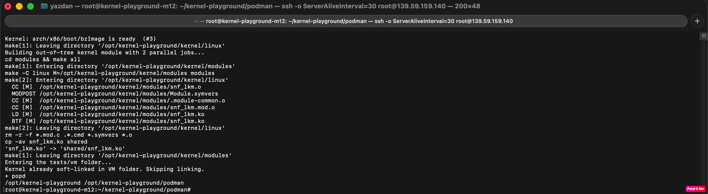
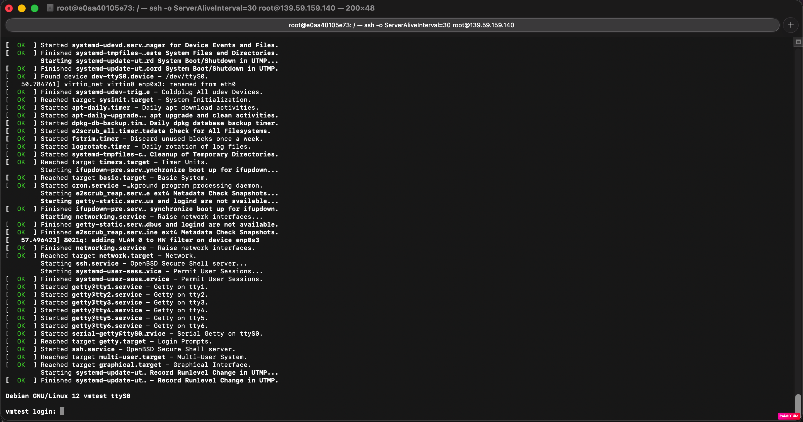
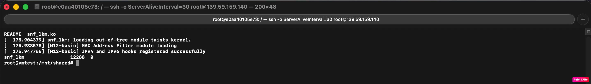
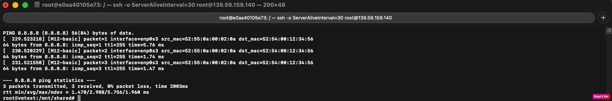
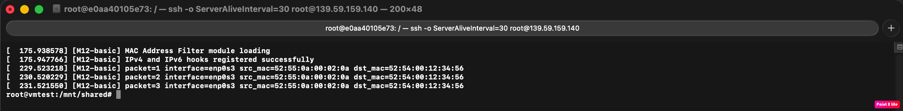
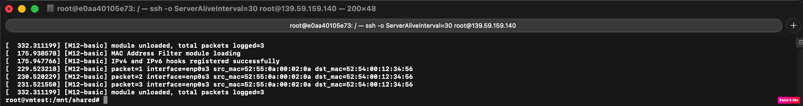

# M12 — MAC Address Filter

## Project Overview

This project implements **M12 — MAC Address Filter** for the Software Networks course.

The project is implemented as a Linux kernel module using the Netfilter framework. The module inspects incoming packets at the PRE_ROUTING stage and logs the source MAC address of incoming Ethernet frames.

## Implemented Level

This repository implements the **Basic level** of M12.

Basic requirement:

> Log the source MAC address of incoming frames.

Intermediate and Advanced levels are optional and are not implemented in this submission.

## Environment

The project was built and tested using the official `kernel-playground` environment.

Environment used:

* Cloud provider: DigitalOcean Droplet
* Operating system: Ubuntu 24.04 LTS x86_64
* Container: Podman
* Test VM: QEMU VM provided by `kernel-playground`
* Kernel module file: `kernel/modules/snf_lkm.c`

This follows the recommended course environment and gives a reproducible build and test process.

## Implementation Details

The module registers Netfilter hooks for IPv4 and IPv6 packets at the PRE_ROUTING stage.

For each incoming packet, the module:

1. Checks that the socket buffer is valid.
2. Reads the Ethernet header using `eth_hdr(skb)`.
3. Extracts the source MAC address from `eth->h_source`.
4. Extracts the destination MAC address from `eth->h_dest`.
5. Logs the packet number, input interface, source MAC, and destination MAC.
6. Accepts the packet using `NF_ACCEPT`.

The module does not drop packets because the Basic level only requires logging.

Example output:

```text
[M12-basic] packet=1 interface=enp0s3 src_mac=52:55:0a:00:02:0a dst_mac=52:54:00:12:34:56
```

## Build Instructions

From the root of the repository:

```bash
cd podman
./container-build.sh
yes y | ./setup-all.sh
```

Expected result:

```text
snf_lkm.ko -> shared/snf_lkm.ko
```

## Run and Test Instructions

Start the container and run the QEMU VM:

```bash
cd podman
./run-detach.sh
podman exec -it kernel-builder bash
cd /opt/kernel-playground/tests/vm
./run.sh
```

When the QEMU VM reaches the login prompt, login as:

```text
root
```

Then run:

```bash
cd /mnt/shared
ls
dmesg -C
insmod snf_lkm.ko
lsmod | grep snf_lkm
ping -c 3 8.8.8.8
dmesg | grep M12
rmmod snf_lkm
dmesg | grep M12 | tail -20
```

## Experimental Evidence

### 1. Setup completed successfully



### 2. QEMU VM boot



### 3. Module loaded



### 4. Traffic generated



### 5. MAC address logs



### 6. Module unloaded



## Design Choices

`NF_INET_PRE_ROUTING` was used because packets are inspected as soon as they enter the network stack.

The Ethernet header is accessed with `eth_hdr(skb)`.

The source MAC address is printed using `%pM`, which is the standard kernel format specifier for MAC addresses.

An atomic counter is used to count logged packets safely.

## Conclusion

The M12 Basic-level requirement is successfully implemented and tested. The module logs the source MAC address of incoming frames, shows the input interface, logs the destination MAC address, counts packets, and unloads safely.
